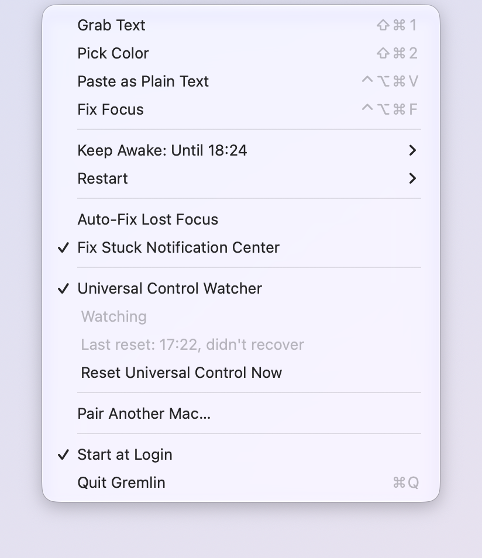
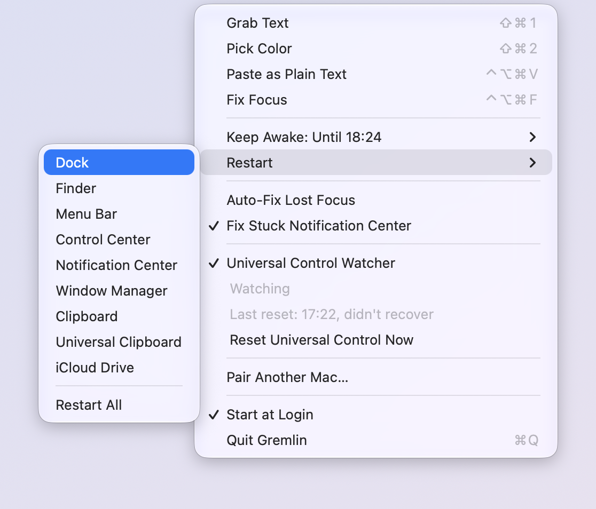
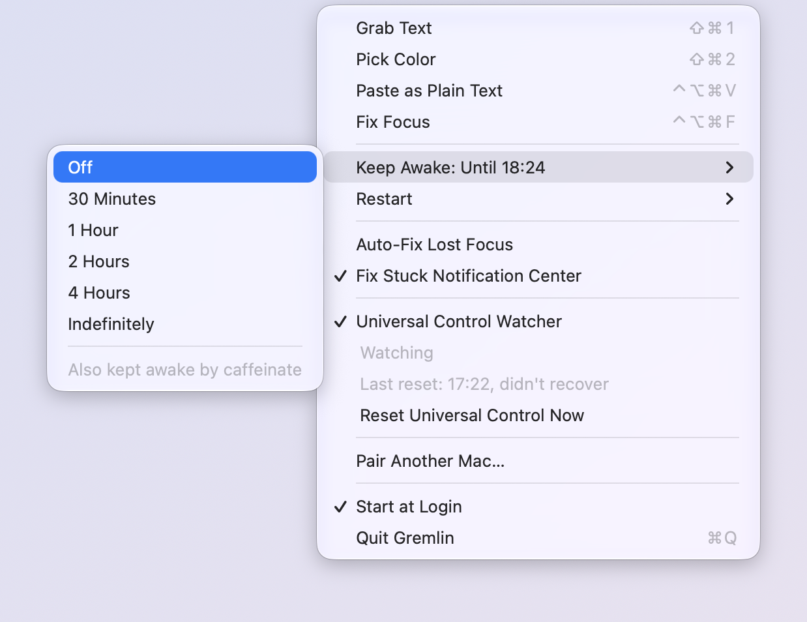

# Gremlin

A small menu bar app that fixes the everyday kinks of macOS: lost window focus, a stuck Dock or Notification Center, Universal Control that won't reconnect. It also grabs text and colors off the screen.

<p align="center">
  
</p>

It's a handful of Swift files with no dependencies, built from the command line. It runs as you and never asks for an admin password.

## Features

### Text and color

| Feature | What it does |
| --- | --- |
| **Grab Text** `⌘⇧1` | Drag over any part of the screen (space switches to window mode) and the text in it goes to the clipboard. It uses Apple's on-device text recognition, the same engine as Live Text. If the selection has a **QR code or barcode**, its content is copied instead. |
| **Pick Color** `⌘⇧2` | Opens the system color loupe. The color you click goes to the clipboard as sRGB hex, e.g. `#1e1e2e`. |
| **Paste as Plain Text** `⌃⌥⌘V` | Strips the formatting from the clipboard and pastes. |

### Focus

macOS sometimes ends up with the menu bar showing one app while your typing goes nowhere, or to a window behind it. It happens most after switching Spaces or using Universal Control. The usual fix is switching to another app and back.

| Feature | What it does |
| --- | --- |
| **Fix Focus** `⌃⌥⌘F` | Does that switch in one keystroke. Gremlin takes focus for a moment, hands it back to the app whose window is on top, and raises that window. |
| **Auto-Fix Lost Focus** | Does it for you. It steps in when the frontmost app has windows on screen but none of them has focus, or another app's window sits on top of them, for 3 seconds. Apps that never report focus properly are left alone after one try. Off by default. |

### Unstick macOS

<p align="center">
  
</p>

When part of macOS hangs, restarting just that part usually fixes it, without logging out. **Restart** does it from the menu, one at a time or all at once:

| Item | Restarts | Try it when |
| --- | --- | --- |
| Dock | `Dock` | Mission Control, Spaces or `⌃`-number shortcuts stop working, often after sleep |
| Finder | `Finder` | Finder windows or the desktop stop responding |
| Menu Bar | `SystemUIServer` | Menu bar items are missing or frozen |
| Control Center | `ControlCenter` | Control Center or its menu bar icons misbehave |
| Notification Center | `NotificationCenter` | Banners freeze or notifications stop showing |
| Window Manager | `WindowManager` | Stage Manager or window tiling gets stuck |
| Clipboard | `pboard` | Copy, paste or drag and drop stop working. This empties the clipboard. |
| Universal Clipboard | `useractivityd`, then `pboard` | Copying on one device no longer pastes on another |
| iCloud Drive | `bird` | iCloud Drive stops syncing |

All of these run as you, and macOS starts them again right away.

**Fix Stuck Notification Center** watches for a macOS 27 bug where a banner freezes halfway in and Notification Center spins at 100% CPU. If it stays above 90% for 30 seconds, Gremlin restarts it. On by default.

### Keep Awake

<p align="center">
  
</p>

Keeps the display and the Mac awake for 30 minutes to 4 hours, or until you turn it off. The menu shows when it ends, and lists any other app that is keeping the Mac awake. It survives a Gremlin restart until its time is up.

### Universal Control

**What it is.** Universal Control lets one keyboard and mouse work across Macs and iPads sitting next to each other. You move the pointer past the edge of one screen and keep going on the next device.

**The pain.** After a Mac wakes up, the devices sometimes fail their first handshake, and macOS gives up for good. The pointer stays stuck on one side until you go into System Settings on the right Mac and turn Universal Control off and on.

**How Gremlin fixes it.** Gremlin runs on each Mac, reads Universal Control's logs to spot the moment it gives up, and toggles it automatically, retrying with increasing delays. Paired Gremlins talk over the local network, so whichever Mac notices the problem can get the *other* Mac to toggle. One Mac coordinates, so they don't both toggle at once, and the first toggle goes to whichever Mac is refusing the connection.

To pair, install Gremlin on both Macs, choose **Pair Another Mac…** on each, and click Pair on both if the 6-digit codes match. The menu then shows the other Mac's status, and **Reset Universal Control** can toggle it on this Mac, the other one, or both. The details are [further down](#how-the-universal-control-fix-works).

## Install

Requires macOS 14 or later and the Xcode Command Line Tools (`xcode-select --install`).

```sh
git clone https://github.com/alicin/gremlin.git
./gremlin/install.sh
```

This builds `~/Applications/Gremlin.app`, signs it, starts it, and adds it as a login item. Run `install.sh` again after pulling changes.

The app is signed with a self-signed "Gremlin Code Signing" certificate that the installer creates in your login keychain the first time. macOS ties permissions to that certificate, so they survive rebuilds. The first build may ask to let `codesign` use the key; choose Always Allow.

### Permissions

macOS asks for each permission the first time a feature needs it:

| Permission | Needed for |
| --- | --- |
| Screen Recording | Grab Text |
| Accessibility | Auto-Fix Lost Focus, and the paste step of Paste as Plain Text (without it, the clipboard is still made plain and you press `⌘V`) |
| Local Network | Pairing with another Mac |
| Notifications | Universal Control reset results |

The hotkeys use Carbon hotkeys, so they need no permission. Switches (the checkmark items) are remembered between launches. Everything is logged to `~/Library/Logs/Gremlin.log`.

## How the Universal Control fix works

### The bug in detail

Seen on macOS 27.0 (26A428). When the other Mac wakes or comes back into range, Universal Control runs an "initial sync". If the other Mac isn't ready yet, all 6 retries fail. This Mac then marks the peer `valid=false` and never retries on its own. The other Mac keeps opening a connection every 60 s over AWDL, gets no answer, and hangs up, forever. It only recovers when the peer disappears and comes back, or Universal Control is toggled.

### Detecting and resetting

It streams Universal Control's logs as the current user:

```sh
/usr/bin/log stream --style ndjson --predicate 'process == "UniversalControl" AND category == "SYNC"'
```

- **Gave up:** `IDS <peer>: Initial Sync (Retry 6 of 6)`, then `IDS <peer>: Initial Sync Failed: …`, then `IDS <peer>: available=true, valid=false`
- **Recovered:** `In-Circle Devices: [<peer>]`
- **Peer gone:** `IDS <peer>: Device Unavailable` / `Device Lost`

`<peer>` is any 8-hex-digit device ID. How long the retries take depends on the failure. `-6722` means the other Mac didn't answer, and each retry waits up to ~30 s. `-71143` means the other Mac reset the connection during pairing verification, and all 6 retries fail within seconds.

When a peer gives up, the watcher waits 10 s and flips the same setting as the System Settings toggle, off for 3 s and back on:

```sh
defaults -currentHost write com.apple.universalcontrol Disable -bool true
sleep 3
defaults -currentHost write com.apple.universalcontrol Disable -bool false
```

The flip makes the peer go unavailable and available again and starts a fresh initial sync. The watcher ignores that unavailable/available pair and judges the reset by the result of the new sync: the peer joining is a recovery, and giving up again is a failed reset. Failed resets back off (10 s, 1 min, 5 min), then it tries again every 30 min while the peer stays stuck. It never resets a peer that is away, and it restarts `log stream` if it exits. If Gremlin quits mid-flip, Universal Control is switched back on at quit or on the next launch.

Flipping it on this Mac does not always help. When the other Mac is the one refusing the connection (`-71143`), resets here change nothing and it needs a toggle over there. That is what pairing is for.

### Two Macs: pairing and coordination

Install Gremlin on both Macs and choose **Pair Another Mac…** on each within 2 minutes. Both show a 6-digit code. Click Pair on both if the codes match. The first time, macOS asks to allow Gremlin to find devices on the local network.

Once paired, the Macs talk over the local network (Bonjour, `_gremlin._tcp`, TCP port 47101), not over the AWDL link Universal Control uses. When Bonjour can't see the other Mac, Gremlin tries the addresses it last reported, which includes its Tailscale address. Only three messages exist: `status`, `reset` (flip Universal Control on the receiving Mac) and `stuck` (tell the other Mac what this one sees). Each is signed with a key agreed during pairing (Curve25519, HMAC-SHA256), with a timestamp and nonce so it can't be replayed. The key is kept in the login keychain.

Only one of the two Macs runs the resets, so they don't toggle each other at the same time. The other one reports what it sees to that Mac and waits. When a Mac logs `-71143`, the other Mac refused, so the first reset happens on the refusing Mac. Otherwise it happens on the Mac that saw the failure. The next ones go to the other Mac, then both. If the other Mac can't be reached, each Mac falls back to resetting itself.

The Reset Universal Control submenu does the same by hand: on this Mac, on the other one, or on both.

Resets and their results go to the menu, to a notification, and to `~/Library/Logs/Gremlin.log`.

Don't reset Universal Control any other way. `killall UniversalControl` is ignored, `launchctl kickstart -k gui/$UID/com.apple.ensemble` is refused by SIP, and `kill -9` gets it relaunched but left the other Mac holding a dead session until Universal Control was toggled on that Mac.

## Uninstall

Turn off Start at Login, quit Gremlin, then:

```sh
rm -rf ~/Applications/Gremlin.app
defaults delete com.bunniesinc.gremlin
security delete-generic-password -s com.bunniesinc.gremlin.peer ~/Library/Keychains/login.keychain-db
security delete-identity -c "Gremlin Code Signing" ~/Library/Keychains/login.keychain-db
```
